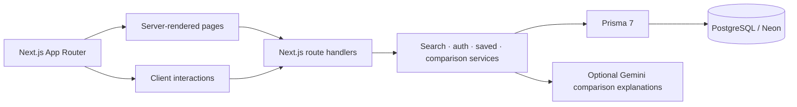

# CampusLens

> **See your options clearly.**

CampusLens is a college discovery app for exploring colleges, reviewing key facts, comparing options, and saving a shortlist. It was built for the AI Software Engineer internship assignment (Full Stack Engineer · Track A).

**Flow:** `DISCOVER → UNDERSTAND → COMPARE → SHORTLIST`

## See it running

- [Live app](https://campuslens-tan.vercel.app/)
- [Discover colleges](https://campuslens-tan.vercel.app/discover?pageSize=12)
- [Compare colleges](https://campuslens-tan.vercel.app/compare)
- [Design system lab](https://campuslens-tan.vercel.app/design-system)
- [Health check](https://campuslens-tan.vercel.app/api/health)

### Screenshots

Open the links above to view the responsive screens. The main views are:

| Screen | What to look for |
|---|---|
| Homepage | Liquid-glass landing experience and product flow |
| Discover | Search, filters, academic profile, Cards/List toggle and pagination |
| College detail | Courses, fees, placements and reviews for one college |
| Compare | Side-by-side facts and optional comparison insights |
| Account | Profile editing and saved colleges/comparisons |

## Features

- Search colleges by name, course, city, state, discipline, ownership, degree level, fee and rating.
- Switch Discover between card and compact list layouts; the list adapts to viewport width.
- Open a college by clicking its card to see courses, fees, placements and reviews.
- Compare two to four colleges with consistent metrics and clear missing-data handling.
- Create an account, edit an optional academic profile, save colleges and save comparisons.
- Server-side validation, origin checks, secure password hashing, HttpOnly sessions and database-backed throttling.

## Architecture



The project is a modular monolith. Pages and route handlers own request boundaries; service modules own database and domain logic; Prisma is the only database access layer. Client components are used for interactive controls such as filters, compare toggles, saves and motion. Secrets stay server-side in environment variables.

## Local setup

Requires Node.js **20.12+** and PostgreSQL.

```bash
npm ci
cp .env.example .env.local
# Set DATABASE_URL in .env.local
npm run db:deploy
npm run db:seed
npm run db:seed-national
npm run dev -- --port 3210
```

Open <http://localhost:3210>. Register at `/sign-up`; there is no shared demo password.

For the existing Docker database:

```bash
docker start campuslens-phase1-db
```

Use a dedicated prototype database because seed scripts replace their own sample records.

## Useful commands

| Command | Purpose |
|---|---|
| `npm run dev` | Start the Turbopack development server |
| `npm run build` | Create a production build |
| `npm run start` | Serve the production build |
| `npm run lint` | Run ESLint |
| `npm run typecheck` | Run TypeScript checks |
| `npm test` | Run the test suite |
| `npm run test:api` | Test the college API |
| `npm run db:generate` | Regenerate Prisma Client |

## Stack

Next.js 16 · React 19 · TypeScript strict mode · Tailwind CSS 4 · Prisma 7 · PostgreSQL/Neon · GSAP · ScrollTrigger · Lenis · Framer Motion · Zod · Vercel

## Project map

```text
src/app/                 Routes, pages and API handlers
src/components/          Reusable UI and interactive components
src/server/              Auth, search, saved-item and comparison services
src/lib/                 Validation, database and shared domain helpers
prisma/                  Schema, migrations and seed entrypoints
data/                    Catalogue seed data
scripts/                 Repeatable data and verification scripts
docs/                     Product, design, architecture and deployment guides
```

## Documentation

- [Product scope](docs/product-scope.md)
- [Architecture details](docs/architecture.md)
- [Database setup](docs/database.md)
- [Search API](docs/search-api.md)
- [Discovery UI](docs/discovery-ui.md)
- [College detail](docs/college-detail.md)
- [PRISM design system](docs/design-system.md)
- [Motion system](docs/motion-system.md)
- [Deployment runbook](docs/deployment.md)
- [Reliability and tests](docs/reliability.md)
- [Loom walkthrough script](docs/submission.md)

## Deploying to Vercel

1. Import `safwanshk11/CampusLens` as a Next.js project.
2. Set `DATABASE_URL` to Neon’s pooled connection string.
3. Set `NEXT_PUBLIC_SITE_URL` to the production origin.
4. Deploy from the `main` branch.

`postinstall` generates Prisma Client before `next build`. See [docs/deployment.md](docs/deployment.md) for environment and migration details.
